<!-- README.md is generated from README.Rmd. Please edit that file -->

# msrat

`msrat` is a tool designed to assess software reliability based on fault
data gathered during the testing phase. This tool utilizes two types of
metrics: d-metrics and s-metrics, both essential for a comprehensive
evaluation.

The d-metrics include variables like the number of test cases and
coverage levels, recorded over specific time periods (e.g., daily or
weekly). These metrics primarily reflect the software testing
environment and are subject to change as testing progresses, capturing
the dynamic nature of the testing process.

On the other hand, s-metrics focus on the software product itself. These
include metrics such as the number of code lines and the complexity of
the software. Unlike d-metrics, s-metrics are generally stable
throughout the testing process, providing a consistent basis for
evaluating the software’s inherent qualities.

## Installation

You can install msrat from GitHub with:

``` r
install.packages("devtools")
devtools::install_github("SwReliab/msrat")
```

Alternatively, you can install msrat with remotes:

``` r
install.packages("remotes")
remotes::install_github("SwReliab/msrat")
```

## Example

This is an example for reliability evaluation with d-metrics.

``` r
### load library
library(msrat)
#> Loading required package: Rsrat
#> Loading required package: Rphsrm
#> Loading required package: Matrix

### load example data for d-metrics
data(dmet)

### dmet.ds1 consists of the number of days (day), the number of faults (fault), the number of testcases (tc), the cumulative number of testcases (ctc), the insrease of C0 coverage (cov) and C0 coverage (ccov).
dmet.ds1
#>    day fault  tc ctc   cov  ccov
#> 1    1     3   5   5 0.018 0.018
#> 2    2    16 175 180 0.409 0.427
#> 3    3     9 186 366 0.066 0.493
#> 4    4     3  67 433 0.132 0.625
#> 5    5     2  14 447 0.013 0.638
#> 6    6     0  54 501 0.055 0.693
#> 7    7     2  28 529 0.021 0.714
#> 8    8     1  15 544 0.018 0.732
#> 9    9     1  23 567 0.024 0.756
#> 10  10     2  17 584 0.026 0.782
#> 11  11     9  74 658 0.051 0.833
#> 12  12     3  43 701 0.011 0.844
#> 13  13     2  20 721 0.002 0.846
#> 14  14     1  12 733 0.013 0.859
#> 15  15     2  18 751 0.018 0.877
#> 16  16     7  19 770 0.018 0.895
#> 17  17     3   9 779 0.000 0.895
#> 18  18     0   9 788 0.003 0.898
#> 19  19     0  32 820 0.014 0.912
#> 20  20     0   8 828 0.000 0.912

### Esimate the model for d-metrics
(result <- fit.srm.logit(formula=fault~., data=dmet.ds1))
#>    fault X.Intercept. day  tc ctc   cov  ccov
#> 1      3            1   1   5   5 0.018 0.018
#> 2     16            1   2 175 180 0.409 0.427
#> 3      9            1   3 186 366 0.066 0.493
#> 4      3            1   4  67 433 0.132 0.625
#> 5      2            1   5  14 447 0.013 0.638
#> 6      0            1   6  54 501 0.055 0.693
#> 7      2            1   7  28 529 0.021 0.714
#> 8      1            1   8  15 544 0.018 0.732
#> 9      1            1   9  23 567 0.024 0.756
#> 10     2            1  10  17 584 0.026 0.782
#> 11     9            1  11  74 658 0.051 0.833
#> 12     3            1  12  43 701 0.011 0.844
#> 13     2            1  13  20 721 0.002 0.846
#> 14     1            1  14  12 733 0.013 0.859
#> 15     2            1  15  18 751 0.018 0.877
#> 16     7            1  16  19 770 0.018 0.895
#> 17     3            1  17   9 779 0.000 0.895
#> 18     0            1  18   9 788 0.003 0.898
#> 19     0            1  19  32 820 0.014 0.912
#> 20     0            1  20   8 828 0.000 0.912
#> 
#> Link function: logit
#> 
#>       omega  (Intercept)          day           tc          ctc          cov  
#>   66.033168    -3.671040     0.522465     0.017718    -0.006349    -0.457267  
#>        ccov  
#>   -0.423316  
#> Maximum LLF: -34.44726 
#> AIC: 82.89452 
#> Convergence: TRUE

### Select metrics in terms of AIC
(result.aic <- step(result))
#> Start:  AIC=82.89
#> fault ~ day + tc + ctc + cov + ccov
#> 
#>        Df    AIC
#> - ccov  1 80.897
#> - cov   1 80.902
#> - ctc   1 81.103
#> <none>    82.895
#> - day   1 86.312
#> - tc    1 91.551
#> 
#> Step:  AIC=80.9
#> fault ~ day + tc + ctc + cov
#> 
#>        Df    AIC
#> - cov   1 79.074
#> <none>    80.897
#> - ctc   1 85.223
#> - day   1 91.844
#> - tc    1 99.140
#> 
#> Step:  AIC=79.07
#> fault ~ day + tc + ctc
#> 
#>        Df     AIC
#> <none>     79.074
#> - ctc   1  86.021
#> - day   1  91.907
#> - tc    1 115.963
#>    fault X.Intercept. day  tc ctc
#> 1      3            1   1   5   5
#> 2     16            1   2 175 180
#> 3      9            1   3 186 366
#> 4      3            1   4  67 433
#> 5      2            1   5  14 447
#> 6      0            1   6  54 501
#> 7      2            1   7  28 529
#> 8      1            1   8  15 544
#> 9      1            1   9  23 567
#> 10     2            1  10  17 584
#> 11     9            1  11  74 658
#> 12     3            1  12  43 701
#> 13     2            1  13  20 721
#> 14     1            1  14  12 733
#> 15     2            1  15  18 751
#> 16     7            1  16  19 770
#> 17     3            1  17   9 779
#> 18     0            1  18   9 788
#> 19     0            1  19  32 820
#> 20     0            1  20   8 828
#> 
#> Link function: logit
#> 
#>       omega  (Intercept)          day           tc          ctc  
#>   66.041755    -3.789003     0.503204     0.016795    -0.006317  
#> Maximum LLF: -34.53719 
#> AIC: 79.07438 
#> Convergence: TRUE

### Draw the number of faults for each day and the number of faults estimated by the model (dmvplot is in Rsrat package)
dmvfplot(fault=dmet.ds1$fault, srms=result.aic)
```


This is an example for reliability evaluation with s-metrics.

``` r
### load example data for s-metrics
data(tomcat5)

### S-metrics for modules: catalina, connector, jasper, servlets, tester and webapps
#### LOC: Lines of code
#### St: The number of statements
#### Br: The number of branches
#### Co: Percentage of comments
#### Fn: The number of functions (methods)
#### Mc: Maximum complexity
#### Ac: Average complexity
tomcat5.smet
#>              LOC    St   Br   Co   Fn  Mc   Ac
#> catalina  125462 39386 19.2 34.4 4543  90 2.79
#> connector 168482 65829 19.2 26.9 5912 175 3.37
#> jasper     41861 15557 19.2 26.8 1691  90 2.88
#> servlets   15480  1944  8.0 66.5  400  26 1.45
#> tester     12677  4750 19.7 30.2  409  54 3.36
#> webapps    37782 12851  9.5 31.2 1035  39 2.32

### Each module has the fault data (grouped data)
tomcat5.catalina
#>     time fault
#> 1     31     0
#> 2     30     0
#> 3     31     0
#> 4     31     0
#> 5     30     0
#> 6     31     0
#> 7     30     0
#> 8     31     2
#> 9     31     0
#> 10    28     1
#> 11    31     0
#> 12    30     0
#> 13    31     0
#> 14    30     0
#> 15    31     0
#> 16    31     1
#> 17    30     1
#> 18    31     3
#> 19    30     8
#> 20    31     6
#> 21    31    12
#> 22    28     6
#> 23    31     9
#> 24    30    11
#> 25    31    10
#> 26    30    13
#> 27    31     7
#> 28    31     7
#> 29    30     6
#> 30    31     6
#> 31    30     9
#> 32    31     2
#> 33    31     8
#> 34    28     7
#> 35    31     5
#> 36    30     7
#> 37    31    10
#> 38    30     4
#> 39    31     5
#> 40    31     5
#> 41    30     2
#> 42    31     3
#> 43    30     1
#> 44    31     3
#> 45    31     4
#> 46    29     1
#> 47    31     6
#> 48    30     2
#> 49    31     3
#> 50    30     5
#> 51    31     1
#> 52    31     5
#> 53    30     4
#> 54    31     3
#> 55    30     4
#> 56    31     2
#> 57    31     1
#> 58    28     1
#> 59    31     3
#> 60    30     5
#> 61    31     2
#> 62    30     0
#> 63    31     3
#> 64    31     1
#> 65    30     1
#> 66    31     8
#> 67    30     1
#> 68    31     0
#> 69    31     2
#> 70    28     1
#> 71    31     3
#> 72    30     1
#> 73    31     0
#> 74    30     1
#> 75    31     0
#> 76    31     1
#> 77    30     2
#> 78    31     1
#> 79    30     1
#> 80    31     1
#> 81    31     2
#> 82    28     1
#> 83    31     0
#> 84    30     1
#> 85    31     0
#> 86    30     0
#> 87    31     2
#> 88    31     1
#> 89    30     0
#> 90    31     0
#> 91    30     0
#> 92    31     1
#> 93    31     0
#> 94    29     1
#> 95    31     0
#> 96    30     1
#> 97    31     0
#> 98    30     0
#> 99    31     2
#> 100   31     0
#> 101   30     0
#> 102   31     0
#> 103   30     0
#> 104   31     0
#> 105   31     0
#> 106   28     0
#> 107   31     0
#> 108   30     0

### List for fault data
data.tomcat5 <- list(catalina=tomcat5.catalina,
                     connector=tomcat5.connector,
                     jasper=tomcat5.jasper,
                     servlets=tomcat5.servlets,
                     tester=tomcat5.tester,
                     webapps=tomcat5.webapps)

### Estimate NHPP model (gamma model) parameters using Rsrt
# library(Rsrat)
(results.tomcat5 <- lapply(data.tomcat5,
                          function(d) fit.srm.nhpp(time=d$time,
                                                   fault=d$fault,
                                                   srm.names=c("gamma"))))
#> $catalina
#> Model name: gamma
#>     omega      shape       rate  
#> 2.729e+02  4.677e+00  3.861e-03  
#> Maximum LLF: -177.7182 
#> AIC: 361.4365 
#> Convergence: TRUE 
#> 
#> 
#> $connector
#> Model name: gamma
#>     omega      shape       rate  
#> 89.335012   4.865692   0.003888  
#> Maximum LLF: -110.3019 
#> AIC: 226.6037 
#> Convergence: TRUE 
#> 
#> 
#> $jasper
#> Model name: gamma
#>     omega      shape       rate  
#> 74.042904   4.778298   0.004604  
#> Maximum LLF: -92.44426 
#> AIC: 190.8885 
#> Convergence: TRUE 
#> 
#> 
#> $servlets
#> Model name: gamma
#>     omega      shape       rate  
#> 57.031424   5.282532   0.004888  
#> Maximum LLF: -83.21093 
#> AIC: 172.4219 
#> Convergence: TRUE 
#> 
#> 
#> $tester
#> Model name: gamma
#>    omega     shape      rate  
#>      1.0  163562.2      84.6  
#> Maximum LLF: -1.001187 
#> AIC: 8.002374 
#> Convergence: TRUE 
#> 
#> 
#> $webapps
#> Model name: gamma
#>     omega      shape       rate  
#> 65.826028   2.752425   0.002343  
#> Maximum LLF: -105.1848 
#> AIC: 216.3696 
#> Convergence: TRUE

### Estimate s-metrics (LOC and St) parameters
(result <- fit.srm.poireg(formula=~LOC+St, data=tomcat5.smet, srms=results.tomcat5))
#>           X.Intercept.    LOC    St
#> catalina             1 125462 39386
#> connector            1 168482 65829
#> jasper               1  41861 15557
#> servlets             1  15480  1944
#> tester               1  12677  4750
#> webapps              1  37782 12851
#> 
#> Link function: log
#>   (Intercept)           LOC            St 
#>  3.715768e+00  5.507954e-05 -1.279337e-04 
#> 
#> catalina
#> Model name: gamma
#> [1]  2.670e+02  4.680e+00  3.864e-03
#> 
#> connector
#> Model name: gamma
#> [1]  96.924516   4.853124   0.003875
#> 
#> jasper
#> Model name: gamma
#> [1]  56.327808   4.785058   0.004612
#> 
#> servlets
#> Model name: gamma
#> [1]  75.165793   5.272732   0.004877
#> 
#> tester
#> Model name: gamma
#> [1]  4.498e+01  2.211e+00  9.050e-05
#> 
#> webapps
#> Model name: gamma
#> [1]  63.605977   2.760161   0.002353
#> Maximum LLF: -579.6683 
#> AIC: 1189.337 
#> Convergence: TRUE

### Draw 
mvfplot(time=time, fault=fault, data=tomcat5.catalina,
        srms=list(results.tomcat5$catalina, result$srm$srms$catalina))
```


``` r

mvfplot(time=time, fault=fault, data=tomcat5.connector,
        srms=list(results.tomcat5$connector, result$srm$srms$connector))
```

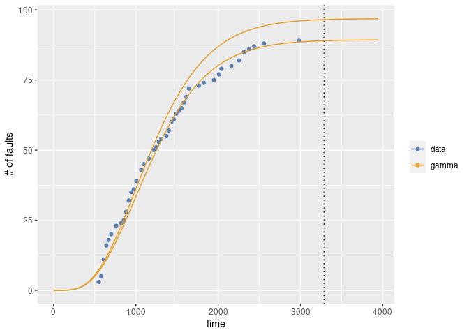

``` r

mvfplot(time=time, fault=fault, data=tomcat5.jasper,
        srms=list(results.tomcat5$jasper, result$srm$srms$jasper))
```

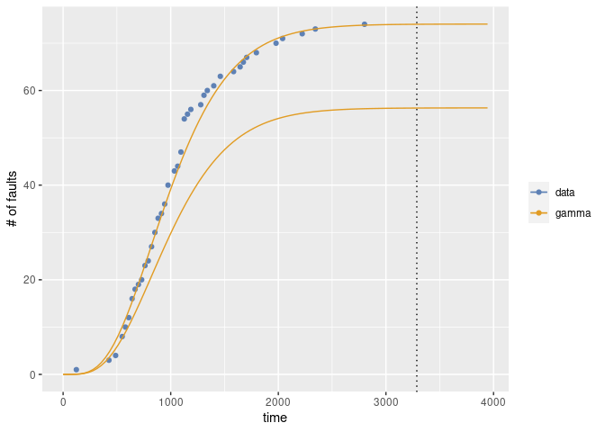

``` r

mvfplot(time=time, fault=fault, data=tomcat5.servlets,
        srms=list(results.tomcat5$servlets, result$srm$srms$servlets))
```

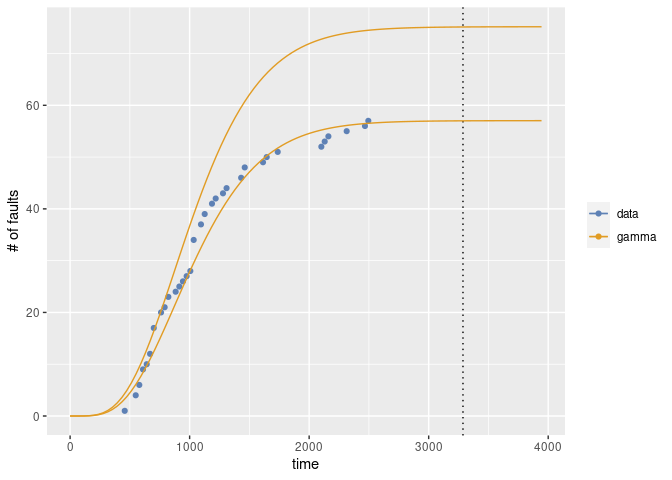

``` r

mvfplot(time=time, fault=fault, data=tomcat5.tester,
        srms=list(results.tomcat5$tester, result$srm$srms$tester))
```

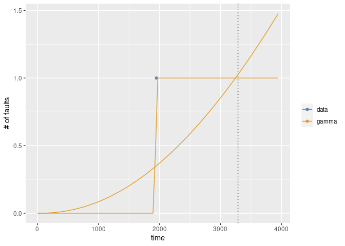

``` r

mvfplot(time=time, fault=fault, data=tomcat5.webapps,
        srms=list(results.tomcat5$webapps, result$srm$srms$webapps))
```

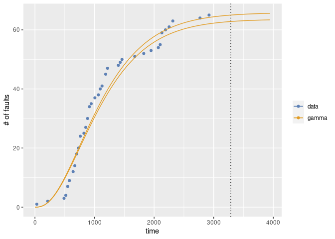

## Examples for penalized MLE

This is an example by applying the penalized MLE on regression
coefficients.

``` r
### load library
library(msrat)

### load example data for d-metrics
data(dmet)

### dmet.ds1 consists of the number of days (day), the number of faults (fault), the number of testcases (tc), the cumulative number of testcases (ctc), the insrease of C0 coverage (cov) and C0 coverage (ccov).
dmet.ds1
#>    day fault  tc ctc   cov  ccov
#> 1    1     3   5   5 0.018 0.018
#> 2    2    16 175 180 0.409 0.427
#> 3    3     9 186 366 0.066 0.493
#> 4    4     3  67 433 0.132 0.625
#> 5    5     2  14 447 0.013 0.638
#> 6    6     0  54 501 0.055 0.693
#> 7    7     2  28 529 0.021 0.714
#> 8    8     1  15 544 0.018 0.732
#> 9    9     1  23 567 0.024 0.756
#> 10  10     2  17 584 0.026 0.782
#> 11  11     9  74 658 0.051 0.833
#> 12  12     3  43 701 0.011 0.844
#> 13  13     2  20 721 0.002 0.846
#> 14  14     1  12 733 0.013 0.859
#> 15  15     2  18 751 0.018 0.877
#> 16  16     7  19 770 0.018 0.895
#> 17  17     3   9 779 0.000 0.895
#> 18  18     0   9 788 0.003 0.898
#> 19  19     0  32 820 0.014 0.912
#> 20  20     0   8 828 0.000 0.912

### Esimate the model for d-metrics
### lambda is the hyper parameter to determine the magniture of penalty.
### alpha is the parameter to determine the lorm; alpha=1 means L1 norm, alpha=0 indicates L2 norm
(result <- fit.srm.logit.penalized(formula=fault~., data=dmet.ds1, lambda=0.01, alpha=1))
#> Warning in Rsrat::emfit(model, ldata, initialize = TRUE, maxiter =
#> con$maxiter, : LLF decreses: dGLM.penalized.logit 3 -3.340339e-01
#> Warning in Rsrat::emfit(model, ldata, initialize = TRUE, maxiter =
#> con$maxiter, : LLF decreses: dGLM.penalized.logit 4 -2.831606e-01
#> Warning in Rsrat::emfit(model, ldata, initialize = TRUE, maxiter =
#> con$maxiter, : LLF decreses: dGLM.penalized.logit 5 -2.438543e-01
#> Warning in Rsrat::emfit(model, ldata, initialize = TRUE, maxiter =
#> con$maxiter, : LLF decreses: dGLM.penalized.logit 6 -2.197594e-01
#> Warning in Rsrat::emfit(model, ldata, initialize = TRUE, maxiter =
#> con$maxiter, : LLF decreses: dGLM.penalized.logit 7 -2.044208e-01
#> Warning in Rsrat::emfit(model, ldata, initialize = TRUE, maxiter =
#> con$maxiter, : LLF decreses: dGLM.penalized.logit 8 -1.961206e-01
#> Warning in Rsrat::emfit(model, ldata, initialize = TRUE, maxiter =
#> con$maxiter, : LLF decreses: dGLM.penalized.logit 9 -1.901647e-01
#> Warning in Rsrat::emfit(model, ldata, initialize = TRUE, maxiter =
#> con$maxiter, : LLF decreses: dGLM.penalized.logit 10 -1.875937e-01
#> Warning in Rsrat::emfit(model, ldata, initialize = TRUE, maxiter =
#> con$maxiter, : LLF decreses: dGLM.penalized.logit 11 -1.886915e-01
#> Warning in Rsrat::emfit(model, ldata, initialize = TRUE, maxiter =
#> con$maxiter, : LLF decreses: dGLM.penalized.logit 12 -1.885642e-01
#> Warning in Rsrat::emfit(model, ldata, initialize = TRUE, maxiter =
#> con$maxiter, : LLF decreses: dGLM.penalized.logit 13 -1.907901e-01
#> Warning in Rsrat::emfit(model, ldata, initialize = TRUE, maxiter =
#> con$maxiter, : LLF decreses: dGLM.penalized.logit 14 -1.939662e-01
#> Warning in Rsrat::emfit(model, ldata, initialize = TRUE, maxiter =
#> con$maxiter, : LLF decreses: dGLM.penalized.logit 15 -1.979347e-01
#> Warning in Rsrat::emfit(model, ldata, initialize = TRUE, maxiter =
#> con$maxiter, : LLF decreses: dGLM.penalized.logit 16 -2.026408e-01
#> Warning in Rsrat::emfit(model, ldata, initialize = TRUE, maxiter =
#> con$maxiter, : LLF decreses: dGLM.penalized.logit 17 -2.080743e-01
#> Warning in Rsrat::emfit(model, ldata, initialize = TRUE, maxiter =
#> con$maxiter, : LLF decreses: dGLM.penalized.logit 18 -2.140383e-01
#> Warning in Rsrat::emfit(model, ldata, initialize = TRUE, maxiter =
#> con$maxiter, : LLF decreses: dGLM.penalized.logit 19 -2.207260e-01
#> Warning in Rsrat::emfit(model, ldata, initialize = TRUE, maxiter =
#> con$maxiter, : LLF decreses: dGLM.penalized.logit 20 -2.281232e-01
#> Warning in Rsrat::emfit(model, ldata, initialize = TRUE, maxiter =
#> con$maxiter, : LLF decreses: dGLM.penalized.logit 21 -2.361763e-01
#> Warning in Rsrat::emfit(model, ldata, initialize = TRUE, maxiter =
#> con$maxiter, : LLF decreses: dGLM.penalized.logit 22 -2.449357e-01
#> Warning in Rsrat::emfit(model, ldata, initialize = TRUE, maxiter =
#> con$maxiter, : LLF decreses: dGLM.penalized.logit 23 -2.543501e-01
#> Warning in Rsrat::emfit(model, ldata, initialize = TRUE, maxiter =
#> con$maxiter, : LLF decreses: dGLM.penalized.logit 24 -1.900661e-01
#> Warning in Rsrat::emfit(model, ldata, initialize = TRUE, maxiter =
#> con$maxiter, : LLF decreses: dGLM.penalized.logit 84 -6.209730e-06
#> Warning in Rsrat::emfit(model, ldata, initialize = TRUE, maxiter =
#> con$maxiter, : LLF decreses: dGLM.penalized.logit 85 -1.463658e-05
#> Warning in Rsrat::emfit(model, ldata, initialize = TRUE, maxiter =
#> con$maxiter, : LLF decreses: dGLM.penalized.logit 86 -2.207817e-05
#> Warning in Rsrat::emfit(model, ldata, initialize = TRUE, maxiter =
#> con$maxiter, : LLF decreses: dGLM.penalized.logit 87 -2.862707e-05
#> Warning in Rsrat::emfit(model, ldata, initialize = TRUE, maxiter =
#> con$maxiter, : LLF decreses: dGLM.penalized.logit 88 -3.436740e-05
#> Warning in Rsrat::emfit(model, ldata, initialize = TRUE, maxiter =
#> con$maxiter, : LLF decreses: dGLM.penalized.logit 89 -3.937559e-05
#> Warning in Rsrat::emfit(model, ldata, initialize = TRUE, maxiter =
#> con$maxiter, : LLF decreses: dGLM.penalized.logit 90 -4.372116e-05
#> Warning in Rsrat::emfit(model, ldata, initialize = TRUE, maxiter =
#> con$maxiter, : LLF decreses: dGLM.penalized.logit 91 -4.746733e-05
#> Warning in Rsrat::emfit(model, ldata, initialize = TRUE, maxiter =
#> con$maxiter, : LLF decreses: dGLM.penalized.logit 92 -5.067161e-05
#> Warning in Rsrat::emfit(model, ldata, initialize = TRUE, maxiter =
#> con$maxiter, : LLF decreses: dGLM.penalized.logit 93 -5.338636e-05
#> Warning in Rsrat::emfit(model, ldata, initialize = TRUE, maxiter =
#> con$maxiter, : LLF decreses: dGLM.penalized.logit 94 -5.565921e-05
#> Warning in Rsrat::emfit(model, ldata, initialize = TRUE, maxiter =
#> con$maxiter, : LLF decreses: dGLM.penalized.logit 95 -5.753352e-05
#> Warning in Rsrat::emfit(model, ldata, initialize = TRUE, maxiter =
#> con$maxiter, : LLF decreses: dGLM.penalized.logit 96 -5.904879e-05
#> Warning in Rsrat::emfit(model, ldata, initialize = TRUE, maxiter =
#> con$maxiter, : LLF decreses: dGLM.penalized.logit 97 -6.024095e-05
#> Warning in Rsrat::emfit(model, ldata, initialize = TRUE, maxiter =
#> con$maxiter, : LLF decreses: dGLM.penalized.logit 98 -6.114273e-05
#> Warning in Rsrat::emfit(model, ldata, initialize = TRUE, maxiter =
#> con$maxiter, : LLF decreses: dGLM.penalized.logit 99 -6.178394e-05
#> Warning in Rsrat::emfit(model, ldata, initialize = TRUE, maxiter =
#> con$maxiter, : LLF decreses: dGLM.penalized.logit 100 -6.219170e-05
#> Warning in Rsrat::emfit(model, ldata, initialize = TRUE, maxiter =
#> con$maxiter, : LLF decreses: dGLM.penalized.logit 101 -6.239071e-05
#> Warning in Rsrat::emfit(model, ldata, initialize = TRUE, maxiter =
#> con$maxiter, : LLF decreses: dGLM.penalized.logit 102 -6.240345e-05
#> Warning in Rsrat::emfit(model, ldata, initialize = TRUE, maxiter =
#> con$maxiter, : LLF decreses: dGLM.penalized.logit 103 -6.225038e-05
#> Warning in Rsrat::emfit(model, ldata, initialize = TRUE, maxiter =
#> con$maxiter, : LLF decreses: dGLM.penalized.logit 104 -6.195010e-05
#> Warning in Rsrat::emfit(model, ldata, initialize = TRUE, maxiter =
#> con$maxiter, : LLF decreses: dGLM.penalized.logit 105 -6.151954e-05
#> Warning in Rsrat::emfit(model, ldata, initialize = TRUE, maxiter =
#> con$maxiter, : LLF decreses: dGLM.penalized.logit 106 -6.097410e-05
#> Warning in Rsrat::emfit(model, ldata, initialize = TRUE, maxiter =
#> con$maxiter, : LLF decreses: dGLM.penalized.logit 107 -6.032774e-05
#> Warning in Rsrat::emfit(model, ldata, initialize = TRUE, maxiter =
#> con$maxiter, : LLF decreses: dGLM.penalized.logit 108 -5.959319e-05
#> Warning in Rsrat::emfit(model, ldata, initialize = TRUE, maxiter =
#> con$maxiter, : LLF decreses: dGLM.penalized.logit 109 -5.878196e-05
#> Warning in Rsrat::emfit(model, ldata, initialize = TRUE, maxiter =
#> con$maxiter, : LLF decreses: dGLM.penalized.logit 110 -5.790451e-05
#> Warning in Rsrat::emfit(model, ldata, initialize = TRUE, maxiter =
#> con$maxiter, : LLF decreses: dGLM.penalized.logit 111 -5.697035e-05
#> Warning in Rsrat::emfit(model, ldata, initialize = TRUE, maxiter =
#> con$maxiter, : LLF decreses: dGLM.penalized.logit 112 -5.598804e-05
#> Warning in Rsrat::emfit(model, ldata, initialize = TRUE, maxiter =
#> con$maxiter, : LLF decreses: dGLM.penalized.logit 113 -5.496538e-05
#> Warning in Rsrat::emfit(model, ldata, initialize = TRUE, maxiter =
#> con$maxiter, : LLF decreses: dGLM.penalized.logit 114 -5.390939e-05
#> Warning in Rsrat::emfit(model, ldata, initialize = TRUE, maxiter =
#> con$maxiter, : LLF decreses: dGLM.penalized.logit 115 -5.282643e-05
#> Warning in Rsrat::emfit(model, ldata, initialize = TRUE, maxiter =
#> con$maxiter, : LLF decreses: dGLM.penalized.logit 116 -5.172221e-05
#> Warning in Rsrat::emfit(model, ldata, initialize = TRUE, maxiter =
#> con$maxiter, : LLF decreses: dGLM.penalized.logit 117 -5.060191e-05
#> Warning in Rsrat::emfit(model, ldata, initialize = TRUE, maxiter =
#> con$maxiter, : LLF decreses: dGLM.penalized.logit 118 -4.947015e-05
#> Warning in Rsrat::emfit(model, ldata, initialize = TRUE, maxiter =
#> con$maxiter, : LLF decreses: dGLM.penalized.logit 119 -4.833112e-05
#> Warning in Rsrat::emfit(model, ldata, initialize = TRUE, maxiter =
#> con$maxiter, : LLF decreses: dGLM.penalized.logit 120 -4.718854e-05
#> Warning in Rsrat::emfit(model, ldata, initialize = TRUE, maxiter =
#> con$maxiter, : LLF decreses: dGLM.penalized.logit 121 -4.604575e-05
#> Warning in Rsrat::emfit(model, ldata, initialize = TRUE, maxiter =
#> con$maxiter, : LLF decreses: dGLM.penalized.logit 122 -4.490574e-05
#> Warning in Rsrat::emfit(model, ldata, initialize = TRUE, maxiter =
#> con$maxiter, : LLF decreses: dGLM.penalized.logit 123 -4.377115e-05
#> Warning in Rsrat::emfit(model, ldata, initialize = TRUE, maxiter =
#> con$maxiter, : LLF decreses: dGLM.penalized.logit 124 -4.264434e-05
#> Warning in Rsrat::emfit(model, ldata, initialize = TRUE, maxiter =
#> con$maxiter, : LLF decreses: dGLM.penalized.logit 125 -4.152738e-05
#> Warning in Rsrat::emfit(model, ldata, initialize = TRUE, maxiter =
#> con$maxiter, : LLF decreses: dGLM.penalized.logit 126 -4.042210e-05
#> Warning in Rsrat::emfit(model, ldata, initialize = TRUE, maxiter =
#> con$maxiter, : LLF decreses: dGLM.penalized.logit 127 -3.933010e-05
#> Warning in Rsrat::emfit(model, ldata, initialize = TRUE, maxiter =
#> con$maxiter, : LLF decreses: dGLM.penalized.logit 128 -3.825279e-05
#> Warning in Rsrat::emfit(model, ldata, initialize = TRUE, maxiter =
#> con$maxiter, : LLF decreses: dGLM.penalized.logit 129 -3.719137e-05
#> Warning in Rsrat::emfit(model, ldata, initialize = TRUE, maxiter =
#> con$maxiter, : LLF decreses: dGLM.penalized.logit 130 -3.614687e-05
#> Warning in Rsrat::emfit(model, ldata, initialize = TRUE, maxiter =
#> con$maxiter, : LLF decreses: dGLM.penalized.logit 131 -3.512019e-05
#> Warning in Rsrat::emfit(model, ldata, initialize = TRUE, maxiter =
#> con$maxiter, : LLF decreses: dGLM.penalized.logit 132 -3.411207e-05
#> Warning in Rsrat::emfit(model, ldata, initialize = TRUE, maxiter =
#> con$maxiter, : LLF decreses: dGLM.penalized.logit 133 -3.312312e-05
#> Warning in Rsrat::emfit(model, ldata, initialize = TRUE, maxiter =
#> con$maxiter, : LLF decreses: dGLM.penalized.logit 134 -3.215385e-05
#> Warning in Rsrat::emfit(model, ldata, initialize = TRUE, maxiter =
#> con$maxiter, : LLF decreses: dGLM.penalized.logit 135 -3.120465e-05
#> Warning in Rsrat::emfit(model, ldata, initialize = TRUE, maxiter =
#> con$maxiter, : LLF decreses: dGLM.penalized.logit 136 -3.027583e-05
#> Warning in Rsrat::emfit(model, ldata, initialize = TRUE, maxiter =
#> con$maxiter, : LLF decreses: dGLM.penalized.logit 137 -2.936760e-05
#> Warning in Rsrat::emfit(model, ldata, initialize = TRUE, maxiter =
#> con$maxiter, : LLF decreses: dGLM.penalized.logit 138 -2.848012e-05
#> Warning in Rsrat::emfit(model, ldata, initialize = TRUE, maxiter =
#> con$maxiter, : LLF decreses: dGLM.penalized.logit 139 -2.761346e-05
#> Warning in Rsrat::emfit(model, ldata, initialize = TRUE, maxiter =
#> con$maxiter, : LLF decreses: dGLM.penalized.logit 140 -2.676763e-05
#> Warning in Rsrat::emfit(model, ldata, initialize = TRUE, maxiter =
#> con$maxiter, : LLF decreses: dGLM.penalized.logit 141 -2.594259e-05
#> Warning in Rsrat::emfit(model, ldata, initialize = TRUE, maxiter =
#> con$maxiter, : LLF decreses: dGLM.penalized.logit 142 -2.513826e-05
#> Warning in Rsrat::emfit(model, ldata, initialize = TRUE, maxiter =
#> con$maxiter, : LLF decreses: dGLM.penalized.logit 143 -2.435449e-05
#> Warning in Rsrat::emfit(model, ldata, initialize = TRUE, maxiter =
#> con$maxiter, : LLF decreses: dGLM.penalized.logit 144 -2.359112e-05
#> Warning in Rsrat::emfit(model, ldata, initialize = TRUE, maxiter =
#> con$maxiter, : LLF decreses: dGLM.penalized.logit 145 -2.284795e-05
#> Warning in Rsrat::emfit(model, ldata, initialize = TRUE, maxiter =
#> con$maxiter, : LLF decreses: dGLM.penalized.logit 146 -2.212473e-05
#> Warning in Rsrat::emfit(model, ldata, initialize = TRUE, maxiter =
#> con$maxiter, : LLF decreses: dGLM.penalized.logit 147 -2.142122e-05
#> Warning in Rsrat::emfit(model, ldata, initialize = TRUE, maxiter =
#> con$maxiter, : LLF decreses: dGLM.penalized.logit 148 -2.073712e-05
#> Warning in Rsrat::emfit(model, ldata, initialize = TRUE, maxiter =
#> con$maxiter, : LLF decreses: dGLM.penalized.logit 149 -2.007213e-05
#> Warning in Rsrat::emfit(model, ldata, initialize = TRUE, maxiter =
#> con$maxiter, : LLF decreses: dGLM.penalized.logit 150 -1.942594e-05
#> Warning in Rsrat::emfit(model, ldata, initialize = TRUE, maxiter =
#> con$maxiter, : LLF decreses: dGLM.penalized.logit 151 -1.879821e-05
#> Warning in Rsrat::emfit(model, ldata, initialize = TRUE, maxiter =
#> con$maxiter, : LLF decreses: dGLM.penalized.logit 152 -1.818859e-05
#> Warning in Rsrat::emfit(model, ldata, initialize = TRUE, maxiter =
#> con$maxiter, : LLF decreses: dGLM.penalized.logit 153 -1.759673e-05
#> Warning in Rsrat::emfit(model, ldata, initialize = TRUE, maxiter =
#> con$maxiter, : LLF decreses: dGLM.penalized.logit 154 -1.702227e-05
#> Warning in Rsrat::emfit(model, ldata, initialize = TRUE, maxiter =
#> con$maxiter, : LLF decreses: dGLM.penalized.logit 155 -1.646484e-05
#> Warning in Rsrat::emfit(model, ldata, initialize = TRUE, maxiter =
#> con$maxiter, : LLF decreses: dGLM.penalized.logit 156 -1.592406e-05
#> Warning in Rsrat::emfit(model, ldata, initialize = TRUE, maxiter =
#> con$maxiter, : LLF decreses: dGLM.penalized.logit 157 -1.539957e-05
#> Warning in Rsrat::emfit(model, ldata, initialize = TRUE, maxiter =
#> con$maxiter, : LLF decreses: dGLM.penalized.logit 158 -1.489098e-05
#> Warning in Rsrat::emfit(model, ldata, initialize = TRUE, maxiter =
#> con$maxiter, : LLF decreses: dGLM.penalized.logit 159 -1.439791e-05
#> Warning in Rsrat::emfit(model, ldata, initialize = TRUE, maxiter =
#> con$maxiter, : LLF decreses: dGLM.penalized.logit 160 -1.391999e-05
#> Warning in Rsrat::emfit(model, ldata, initialize = TRUE, maxiter =
#> con$maxiter, : LLF decreses: dGLM.penalized.logit 161 -1.345683e-05
#> Warning in Rsrat::emfit(model, ldata, initialize = TRUE, maxiter =
#> con$maxiter, : LLF decreses: dGLM.penalized.logit 162 -1.300808e-05
#> Warning in Rsrat::emfit(model, ldata, initialize = TRUE, maxiter =
#> con$maxiter, : LLF decreses: dGLM.penalized.logit 163 -1.257334e-05
#> Warning in Rsrat::emfit(model, ldata, initialize = TRUE, maxiter =
#> con$maxiter, : LLF decreses: dGLM.penalized.logit 164 -1.215226e-05
#> Warning in Rsrat::emfit(model, ldata, initialize = TRUE, maxiter =
#> con$maxiter, : LLF decreses: dGLM.penalized.logit 165 -1.174448e-05
#> Warning in Rsrat::emfit(model, ldata, initialize = TRUE, maxiter =
#> con$maxiter, : LLF decreses: dGLM.penalized.logit 166 -1.134962e-05
#> Warning in Rsrat::emfit(model, ldata, initialize = TRUE, maxiter =
#> con$maxiter, : LLF decreses: dGLM.penalized.logit 167 -1.096734e-05
#> Warning in Rsrat::emfit(model, ldata, initialize = TRUE, maxiter =
#> con$maxiter, : LLF decreses: dGLM.penalized.logit 168 -1.059729e-05
#> Warning in Rsrat::emfit(model, ldata, initialize = TRUE, maxiter =
#> con$maxiter, : LLF decreses: dGLM.penalized.logit 169 -1.023913e-05
#> Warning in Rsrat::emfit(model, ldata, initialize = TRUE, maxiter =
#> con$maxiter, : LLF decreses: dGLM.penalized.logit 170 -9.892508e-06
#> Warning in Rsrat::emfit(model, ldata, initialize = TRUE, maxiter =
#> con$maxiter, : LLF decreses: dGLM.penalized.logit 171 -9.557105e-06
#> Warning in Rsrat::emfit(model, ldata, initialize = TRUE, maxiter =
#> con$maxiter, : LLF decreses: dGLM.penalized.logit 172 -9.232593e-06
#> Warning in Rsrat::emfit(model, ldata, initialize = TRUE, maxiter =
#> con$maxiter, : LLF decreses: dGLM.penalized.logit 173 -8.918653e-06
#> Warning in Rsrat::emfit(model, ldata, initialize = TRUE, maxiter =
#> con$maxiter, : LLF decreses: dGLM.penalized.logit 174 -8.614973e-06
#> Warning in Rsrat::emfit(model, ldata, initialize = TRUE, maxiter =
#> con$maxiter, : LLF decreses: dGLM.penalized.logit 175 -8.321248e-06
#> Warning in Rsrat::emfit(model, ldata, initialize = TRUE, maxiter =
#> con$maxiter, : LLF decreses: dGLM.penalized.logit 176 -8.037180e-06
#> Warning in Rsrat::emfit(model, ldata, initialize = TRUE, maxiter =
#> con$maxiter, : LLF decreses: dGLM.penalized.logit 177 -7.762476e-06
#> Warning in Rsrat::emfit(model, ldata, initialize = TRUE, maxiter =
#> con$maxiter, : LLF decreses: dGLM.penalized.logit 178 -7.496853e-06
#> Warning in Rsrat::emfit(model, ldata, initialize = TRUE, maxiter =
#> con$maxiter, : LLF decreses: dGLM.penalized.logit 179 -7.240033e-06
#> Warning in Rsrat::emfit(model, ldata, initialize = TRUE, maxiter =
#> con$maxiter, : LLF decreses: dGLM.penalized.logit 180 -6.991744e-06
#> Warning in Rsrat::emfit(model, ldata, initialize = TRUE, maxiter =
#> con$maxiter, : LLF decreses: dGLM.penalized.logit 181 -6.751722e-06
#> Warning in Rsrat::emfit(model, ldata, initialize = TRUE, maxiter =
#> con$maxiter, : LLF decreses: dGLM.penalized.logit 182 -6.519710e-06
#> Warning in Rsrat::emfit(model, ldata, initialize = TRUE, maxiter =
#> con$maxiter, : LLF decreses: dGLM.penalized.logit 183 -6.295457e-06
#> Warning in Rsrat::emfit(model, ldata, initialize = TRUE, maxiter =
#> con$maxiter, : LLF decreses: dGLM.penalized.logit 184 -6.078718e-06
#> Warning in Rsrat::emfit(model, ldata, initialize = TRUE, maxiter =
#> con$maxiter, : LLF decreses: dGLM.penalized.logit 185 -5.869257e-06
#> Warning in Rsrat::emfit(model, ldata, initialize = TRUE, maxiter =
#> con$maxiter, : LLF decreses: dGLM.penalized.logit 186 -5.666842e-06
#> Warning in Rsrat::emfit(model, ldata, initialize = TRUE, maxiter =
#> con$maxiter, : LLF decreses: dGLM.penalized.logit 187 -5.471248e-06
#> Warning in Rsrat::emfit(model, ldata, initialize = TRUE, maxiter =
#> con$maxiter, : LLF decreses: dGLM.penalized.logit 188 -5.282257e-06
#> Warning in Rsrat::emfit(model, ldata, initialize = TRUE, maxiter =
#> con$maxiter, : LLF decreses: dGLM.penalized.logit 189 -5.099656e-06
#> Warning in Rsrat::emfit(model, ldata, initialize = TRUE, maxiter =
#> con$maxiter, : LLF decreses: dGLM.penalized.logit 190 -4.923240e-06
#> Warning in Rsrat::emfit(model, ldata, initialize = TRUE, maxiter =
#> con$maxiter, : LLF decreses: dGLM.penalized.logit 191 -4.752807e-06
#> Warning in Rsrat::emfit(model, ldata, initialize = TRUE, maxiter =
#> con$maxiter, : LLF decreses: dGLM.penalized.logit 192 -4.588164e-06
#> Warning in Rsrat::emfit(model, ldata, initialize = TRUE, maxiter =
#> con$maxiter, : LLF decreses: dGLM.penalized.logit 193 -4.429122e-06
#> Warning in Rsrat::emfit(model, ldata, initialize = TRUE, maxiter =
#> con$maxiter, : LLF decreses: dGLM.penalized.logit 194 -4.275496e-06
#> Warning in Rsrat::emfit(model, ldata, initialize = TRUE, maxiter =
#> con$maxiter, : LLF decreses: dGLM.penalized.logit 195 -4.127111e-06
#> Warning in Rsrat::emfit(model, ldata, initialize = TRUE, maxiter =
#> con$maxiter, : LLF decreses: dGLM.penalized.logit 196 -3.983792e-06
#> Warning in Rsrat::emfit(model, ldata, initialize = TRUE, maxiter =
#> con$maxiter, : LLF decreses: dGLM.penalized.logit 197 -3.845374e-06
#> Warning in Rsrat::emfit(model, ldata, initialize = TRUE, maxiter =
#> con$maxiter, : LLF decreses: dGLM.penalized.logit 198 -3.711693e-06
#> Warning in Rsrat::emfit(model, ldata, initialize = TRUE, maxiter =
#> con$maxiter, : LLF decreses: dGLM.penalized.logit 199 -3.582593e-06
#> Warning in Rsrat::emfit(model, ldata, initialize = TRUE, maxiter =
#> con$maxiter, : LLF decreses: dGLM.penalized.logit 200 -3.457922e-06
#> Warning in Rsrat::emfit(model, ldata, initialize = TRUE, maxiter =
#> con$maxiter, : LLF decreses: dGLM.penalized.logit 201 -3.337532e-06
#> Warning in Rsrat::emfit(model, ldata, initialize = TRUE, maxiter =
#> con$maxiter, : LLF decreses: dGLM.penalized.logit 202 -3.221279e-06
#> Warning in Rsrat::emfit(model, ldata, initialize = TRUE, maxiter =
#> con$maxiter, : LLF decreses: dGLM.penalized.logit 203 -3.109027e-06
#> Warning in Rsrat::emfit(model, ldata, initialize = TRUE, maxiter =
#> con$maxiter, : LLF decreses: dGLM.penalized.logit 204 -3.000639e-06
#> Warning in Rsrat::emfit(model, ldata, initialize = TRUE, maxiter =
#> con$maxiter, : LLF decreses: dGLM.penalized.logit 205 -2.895988e-06
#> Warning in Rsrat::emfit(model, ldata, initialize = TRUE, maxiter =
#> con$maxiter, : LLF decreses: dGLM.penalized.logit 206 -2.794946e-06
#> Warning in Rsrat::emfit(model, ldata, initialize = TRUE, maxiter =
#> con$maxiter, : LLF decreses: dGLM.penalized.logit 207 -2.697392e-06
#> Warning in Rsrat::emfit(model, ldata, initialize = TRUE, maxiter =
#> con$maxiter, : LLF decreses: dGLM.penalized.logit 208 -2.603209e-06
#> Warning in Rsrat::emfit(model, ldata, initialize = TRUE, maxiter =
#> con$maxiter, : LLF decreses: dGLM.penalized.logit 209 -2.512282e-06
#> Warning in Rsrat::emfit(model, ldata, initialize = TRUE, maxiter =
#> con$maxiter, : LLF decreses: dGLM.penalized.logit 210 -2.424501e-06
#> Warning in Rsrat::emfit(model, ldata, initialize = TRUE, maxiter =
#> con$maxiter, : LLF decreses: dGLM.penalized.logit 211 -2.339760e-06
#> Warning in Rsrat::emfit(model, ldata, initialize = TRUE, maxiter =
#> con$maxiter, : LLF decreses: dGLM.penalized.logit 212 -2.257954e-06
#> Warning in Rsrat::emfit(model, ldata, initialize = TRUE, maxiter =
#> con$maxiter, : LLF decreses: dGLM.penalized.logit 213 -2.178985e-06
#> Warning in Rsrat::emfit(model, ldata, initialize = TRUE, maxiter =
#> con$maxiter, : LLF decreses: dGLM.penalized.logit 214 -2.102755e-06
#> Warning in Rsrat::emfit(model, ldata, initialize = TRUE, maxiter =
#> con$maxiter, : LLF decreses: dGLM.penalized.logit 215 -2.029170e-06
#> Warning in Rsrat::emfit(model, ldata, initialize = TRUE, maxiter =
#> con$maxiter, : LLF decreses: dGLM.penalized.logit 216 -1.958142e-06
#> Warning in Rsrat::emfit(model, ldata, initialize = TRUE, maxiter =
#> con$maxiter, : LLF decreses: dGLM.penalized.logit 217 -1.889582e-06
#> Warning in Rsrat::emfit(model, ldata, initialize = TRUE, maxiter =
#> con$maxiter, : LLF decreses: dGLM.penalized.logit 218 -1.823405e-06
#> Warning in Rsrat::emfit(model, ldata, initialize = TRUE, maxiter =
#> con$maxiter, : LLF decreses: dGLM.penalized.logit 219 -1.759531e-06
#> Warning in Rsrat::emfit(model, ldata, initialize = TRUE, maxiter =
#> con$maxiter, : LLF decreses: dGLM.penalized.logit 220 -1.697879e-06
#> Warning in Rsrat::emfit(model, ldata, initialize = TRUE, maxiter =
#> con$maxiter, : LLF decreses: dGLM.penalized.logit 221 -1.638374e-06
#> Warning in Rsrat::emfit(model, ldata, initialize = TRUE, maxiter =
#> con$maxiter, : LLF decreses: dGLM.penalized.logit 222 -1.580942e-06
#> Warning in Rsrat::emfit(model, ldata, initialize = TRUE, maxiter =
#> con$maxiter, : LLF decreses: dGLM.penalized.logit 223 -1.525512e-06
#> Warning in Rsrat::emfit(model, ldata, initialize = TRUE, maxiter =
#> con$maxiter, : LLF decreses: dGLM.penalized.logit 224 -1.472014e-06
#> Warning in Rsrat::emfit(model, ldata, initialize = TRUE, maxiter =
#> con$maxiter, : LLF decreses: dGLM.penalized.logit 225 -1.420382e-06
#> Warning in Rsrat::emfit(model, ldata, initialize = TRUE, maxiter =
#> con$maxiter, : LLF decreses: dGLM.penalized.logit 226 -1.370552e-06
#> Warning in Rsrat::emfit(model, ldata, initialize = TRUE, maxiter =
#> con$maxiter, : LLF decreses: dGLM.penalized.logit 227 -1.322461e-06
#> Warning in Rsrat::emfit(model, ldata, initialize = TRUE, maxiter =
#> con$maxiter, : LLF decreses: dGLM.penalized.logit 228 -1.276050e-06
#> Warning in Rsrat::emfit(model, ldata, initialize = TRUE, maxiter =
#> con$maxiter, : LLF decreses: dGLM.penalized.logit 229 -1.231259e-06
#> Warning in Rsrat::emfit(model, ldata, initialize = TRUE, maxiter =
#> con$maxiter, : LLF decreses: dGLM.penalized.logit 230 -1.188034e-06
#> Warning in Rsrat::emfit(model, ldata, initialize = TRUE, maxiter =
#> con$maxiter, : LLF decreses: dGLM.penalized.logit 231 -1.146320e-06
#> Warning in Rsrat::emfit(model, ldata, initialize = TRUE, maxiter =
#> con$maxiter, : LLF decreses: dGLM.penalized.logit 232 -1.106064e-06
#> Warning in Rsrat::emfit(model, ldata, initialize = TRUE, maxiter =
#> con$maxiter, : LLF decreses: dGLM.penalized.logit 233 -1.067216e-06
#> Warning in Rsrat::emfit(model, ldata, initialize = TRUE, maxiter =
#> con$maxiter, : LLF decreses: dGLM.penalized.logit 234 -1.029728e-06
#> Warning in Rsrat::emfit(model, ldata, initialize = TRUE, maxiter =
#> con$maxiter, : LLF decreses: dGLM.penalized.logit 235 -9.935508e-07
#> Warning in Rsrat::emfit(model, ldata, initialize = TRUE, maxiter =
#> con$maxiter, : LLF decreses: dGLM.penalized.logit 236 -9.586406e-07
#> Warning in Rsrat::emfit(model, ldata, initialize = TRUE, maxiter =
#> con$maxiter, : LLF decreses: dGLM.penalized.logit 237 -9.249526e-07
#> Warning in Rsrat::emfit(model, ldata, initialize = TRUE, maxiter =
#> con$maxiter, : LLF decreses: dGLM.penalized.logit 238 -8.924446e-07
#> Warning in Rsrat::emfit(model, ldata, initialize = TRUE, maxiter =
#> con$maxiter, : LLF decreses: dGLM.penalized.logit 239 -8.610753e-07
#> Warning in Rsrat::emfit(model, ldata, initialize = TRUE, maxiter =
#> con$maxiter, : LLF decreses: dGLM.penalized.logit 240 -8.308053e-07
#> Warning in Rsrat::emfit(model, ldata, initialize = TRUE, maxiter =
#> con$maxiter, : LLF decreses: dGLM.penalized.logit 241 -8.015961e-07
#> Warning in Rsrat::emfit(model, ldata, initialize = TRUE, maxiter =
#> con$maxiter, : LLF decreses: dGLM.penalized.logit 242 -7.734110e-07
#> Warning in Rsrat::emfit(model, ldata, initialize = TRUE, maxiter =
#> con$maxiter, : LLF decreses: dGLM.penalized.logit 243 -7.462140e-07
#> Warning in Rsrat::emfit(model, ldata, initialize = TRUE, maxiter =
#> con$maxiter, : LLF decreses: dGLM.penalized.logit 244 -7.199710e-07
#> Warning in Rsrat::emfit(model, ldata, initialize = TRUE, maxiter =
#> con$maxiter, : LLF decreses: dGLM.penalized.logit 245 -6.946484e-07
#> Warning in Rsrat::emfit(model, ldata, initialize = TRUE, maxiter =
#> con$maxiter, : LLF decreses: dGLM.penalized.logit 246 -6.702141e-07
#> Warning in Rsrat::emfit(model, ldata, initialize = TRUE, maxiter =
#> con$maxiter, : LLF decreses: dGLM.penalized.logit 247 -6.466374e-07
#> Warning in Rsrat::emfit(model, ldata, initialize = TRUE, maxiter =
#> con$maxiter, : LLF decreses: dGLM.penalized.logit 248 -6.238880e-07
#>    fault X.Intercept. day  tc ctc   cov  ccov
#> 1      3            1   1   5   5 0.018 0.018
#> 2     16            1   2 175 180 0.409 0.427
#> 3      9            1   3 186 366 0.066 0.493
#> 4      3            1   4  67 433 0.132 0.625
#> 5      2            1   5  14 447 0.013 0.638
#> 6      0            1   6  54 501 0.055 0.693
#> 7      2            1   7  28 529 0.021 0.714
#> 8      1            1   8  15 544 0.018 0.732
#> 9      1            1   9  23 567 0.024 0.756
#> 10     2            1  10  17 584 0.026 0.782
#> 11     9            1  11  74 658 0.051 0.833
#> 12     3            1  12  43 701 0.011 0.844
#> 13     2            1  13  20 721 0.002 0.846
#> 14     1            1  14  12 733 0.013 0.859
#> 15     2            1  15  18 751 0.018 0.877
#> 16     7            1  16  19 770 0.018 0.895
#> 17     3            1  17   9 779 0.000 0.895
#> 18     0            1  18   9 788 0.003 0.898
#> 19     0            1  19  32 820 0.014 0.912
#> 20     0            1  20   8 828 0.000 0.912
#> 
#> Link function: logit
#> 
#>       omega  (Intercept)          day           tc          ctc          cov  
#>  112.419523    -3.455493     0.000000     0.006046     0.000000     0.745824  
#>        ccov  
#>    0.000000  
#> Maximum LLF: -42.89942 
#> AIC: 99.79884 
#> Convergence: TRUE

### Draw the number of faults for each day and the number of faults estimated by the model (dmvplot is in Rsrat package)
dmvfplot(fault=dmet.ds1$fault, srms=list(result$srm))
```

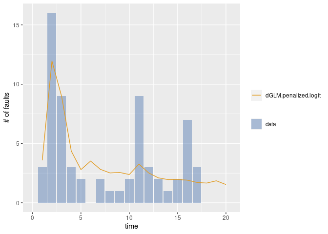

``` r
### load example data for s-metrics
data(tomcat5)

### S-metrics for modules: catalina, connector, jasper, servlets, tester and webapps
#### LOC: Lines of code
#### St: The number of statements
#### Br: The number of branches
#### Co: Percentage of comments
#### Fn: The number of functions (methods)
#### Mc: Maximum complexity
#### Ac: Average complexity
tomcat5.smet
#>              LOC    St   Br   Co   Fn  Mc   Ac
#> catalina  125462 39386 19.2 34.4 4543  90 2.79
#> connector 168482 65829 19.2 26.9 5912 175 3.37
#> jasper     41861 15557 19.2 26.8 1691  90 2.88
#> servlets   15480  1944  8.0 66.5  400  26 1.45
#> tester     12677  4750 19.7 30.2  409  54 3.36
#> webapps    37782 12851  9.5 31.2 1035  39 2.32

### Each module has the fault data (grouped data)
tomcat5.catalina
#>     time fault
#> 1     31     0
#> 2     30     0
#> 3     31     0
#> 4     31     0
#> 5     30     0
#> 6     31     0
#> 7     30     0
#> 8     31     2
#> 9     31     0
#> 10    28     1
#> 11    31     0
#> 12    30     0
#> 13    31     0
#> 14    30     0
#> 15    31     0
#> 16    31     1
#> 17    30     1
#> 18    31     3
#> 19    30     8
#> 20    31     6
#> 21    31    12
#> 22    28     6
#> 23    31     9
#> 24    30    11
#> 25    31    10
#> 26    30    13
#> 27    31     7
#> 28    31     7
#> 29    30     6
#> 30    31     6
#> 31    30     9
#> 32    31     2
#> 33    31     8
#> 34    28     7
#> 35    31     5
#> 36    30     7
#> 37    31    10
#> 38    30     4
#> 39    31     5
#> 40    31     5
#> 41    30     2
#> 42    31     3
#> 43    30     1
#> 44    31     3
#> 45    31     4
#> 46    29     1
#> 47    31     6
#> 48    30     2
#> 49    31     3
#> 50    30     5
#> 51    31     1
#> 52    31     5
#> 53    30     4
#> 54    31     3
#> 55    30     4
#> 56    31     2
#> 57    31     1
#> 58    28     1
#> 59    31     3
#> 60    30     5
#> 61    31     2
#> 62    30     0
#> 63    31     3
#> 64    31     1
#> 65    30     1
#> 66    31     8
#> 67    30     1
#> 68    31     0
#> 69    31     2
#> 70    28     1
#> 71    31     3
#> 72    30     1
#> 73    31     0
#> 74    30     1
#> 75    31     0
#> 76    31     1
#> 77    30     2
#> 78    31     1
#> 79    30     1
#> 80    31     1
#> 81    31     2
#> 82    28     1
#> 83    31     0
#> 84    30     1
#> 85    31     0
#> 86    30     0
#> 87    31     2
#> 88    31     1
#> 89    30     0
#> 90    31     0
#> 91    30     0
#> 92    31     1
#> 93    31     0
#> 94    29     1
#> 95    31     0
#> 96    30     1
#> 97    31     0
#> 98    30     0
#> 99    31     2
#> 100   31     0
#> 101   30     0
#> 102   31     0
#> 103   30     0
#> 104   31     0
#> 105   31     0
#> 106   28     0
#> 107   31     0
#> 108   30     0

### List for fault data
data.tomcat5 <- list(catalina=tomcat5.catalina,
                     connector=tomcat5.connector,
                     jasper=tomcat5.jasper,
                     servlets=tomcat5.servlets,
                     tester=tomcat5.tester,
                     webapps=tomcat5.webapps)

### Estimate NHPP model (gamma model) parameters using Rsrt
# library(Rsrat)
(results.tomcat5 <- lapply(data.tomcat5,
                          function(d) fit.srm.cph(time=d$time,
                                                   fault=d$fault,
                                                   phase=1:10)))
#> Warning in emfit(srm, data, initialize = TRUE, maxiter = con$maxiter, reltol =
#> con$reltol, : Did not converge to MLE by max iteration.
#> $catalina
#> Model name: cph6
#> [1]  275.3
#> [1]   1.000e+00   3.885e-21   3.607e-60  2.356e-107  5.242e-192   0.000e+00
#> [1]  0.001747  0.007476  0.007518  0.007545  0.007571  0.007599
#> Maximum LLF: -173.0685 
#> AIC: 370.137 
#> Convergence: TRUE 
#> 
#> 
#> $connector
#> Model name: cph4
#> [1]  89.68
#> [1]   1.000e+00   9.102e-11   2.870e-46  4.954e-144
#> [1]  0.003152  0.003164  0.003179  0.003194
#> Maximum LLF: -111.0632 
#> AIC: 238.1264 
#> Convergence: TRUE 
#> 
#> 
#> $jasper
#> Model name: cph4
#> [1]  74.11
#> [1]  9.940e-01  1.418e-06  5.181e-09  6.005e-03
#> [1]  0.003796  0.003804  0.003813  0.003901
#> Maximum LLF: -92.94033 
#> AIC: 201.8807 
#> Convergence: TRUE 
#> 
#> 
#> $servlets
#> Model name: cph4
#> [1]  57.12
#> [1]   1.000e+00   2.408e-12   1.359e-49  3.201e-143
#> [1]  0.003664  0.003681  0.003697  0.003711
#> Maximum LLF: -84.24172 
#> AIC: 184.4834 
#> Convergence: TRUE 
#> 
#> 
#> $tester
#> Model name: exp
#>     omega       rate  
#> 3.103e+01  9.950e-06  
#> Maximum LLF: -5.666675 
#> AIC: 15.33335 
#> Convergence: FALSE 
#> 
#> 
#> $webapps
#> Model name: cph3
#> [1]  65.84
#> [1]  9.759e-01  3.757e-23  2.408e-02
#> [1]  0.002142  0.002229  0.003546
#> Maximum LLF: -102.7655 
#> AIC: 217.531 
#> Convergence: TRUE

### Estimate s-metrics parameters with penalty
(result <- fit.srm.poireg.penalized(formula=~., data=tomcat5.smet, srms=results.tomcat5, lambda=1))
#>           X.Intercept.    LOC    St   Br   Co   Fn  Mc   Ac
#> catalina             1 125462 39386 19.2 34.4 4543  90 2.79
#> connector            1 168482 65829 19.2 26.9 5912 175 3.37
#> jasper               1  41861 15557 19.2 26.8 1691  90 2.88
#> servlets             1  15480  1944  8.0 66.5  400  26 1.45
#> tester               1  12677  4750 19.7 30.2  409  54 3.36
#> webapps              1  37782 12851  9.5 31.2 1035  39 2.32
#> 
#> Link function: log
#>   (Intercept)           LOC            St            Br            Co 
#>  3.7113125297  0.0000000000  0.0000000000  0.0839554242  0.0000000000 
#>            Fn            Mc            Ac 
#>  0.0004298972 -0.0189127002  0.0000000000 
#> 
#> catalina
#> Model name: cph6
#> [1]  263.5
#> [1]   1.000e+00   1.382e-18   6.789e-54   2.387e-96  1.240e-172   0.000e+00
#> [1]  0.001760  0.007395  0.007476  0.007527  0.007574  0.007624
#> 
#> connector
#> Model name: cph4
#> [1]  95.11
#> [1]   1.000e+00   8.786e-20   5.864e-92  1.206e-295
#> [1]  0.003168  0.003169  0.003169  0.003170
#> 
#> jasper
#> Model name: cph4
#> [1]  77.33
#> [1]  9.940e-01  1.509e-15  3.589e-22  6.019e-03
#> [1]  0.003807  0.003807  0.003807  0.003889
#> 
#> servlets
#> Model name: cph4
#> [1]  58.16
#> [1]   1.000e+00   5.071e-26  5.902e-112   0.000e+00
#> [1]  0.003688  0.003688  0.003688  0.003688
#> 
#> tester
#> Model name: exp
#> [1]  9.182e+01  3.342e-06
#> 
#> webapps
#> Model name: cph3
#> [1]  67.78
#> [1]  9.761e-01  6.312e-34  2.385e-02
#> [1]  0.002144  0.002200  0.003599
#> Maximum LLF: -570.2602 
#> AIC: 1232.52 
#> Convergence: TRUE

### Draw 
mvfplot(time=time, fault=fault, data=tomcat5.catalina,
        srms=list(results.tomcat5$catalina, result$srm$srms$catalina))
```


``` r

mvfplot(time=time, fault=fault, data=tomcat5.connector,
        srms=list(results.tomcat5$connector, result$srm$srms$connector))
```

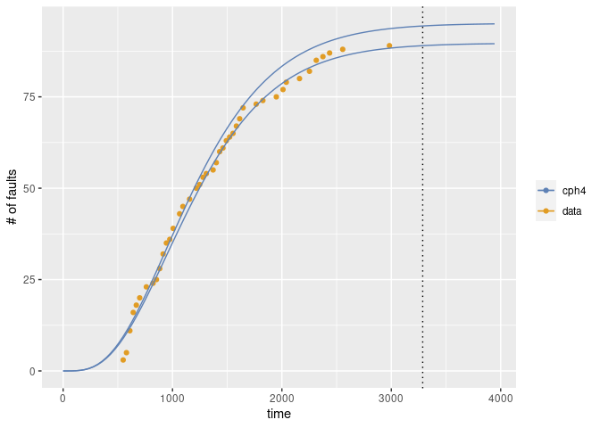

``` r

mvfplot(time=time, fault=fault, data=tomcat5.jasper,
        srms=list(results.tomcat5$jasper, result$srm$srms$jasper))
```

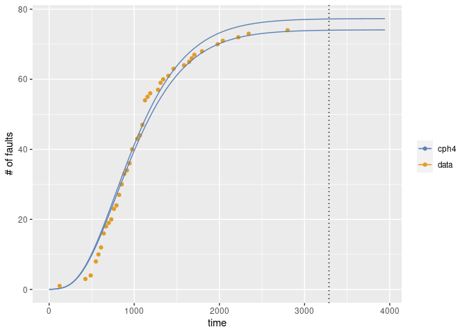

``` r

mvfplot(time=time, fault=fault, data=tomcat5.servlets,
        srms=list(results.tomcat5$servlets, result$srm$srms$servlets))
```

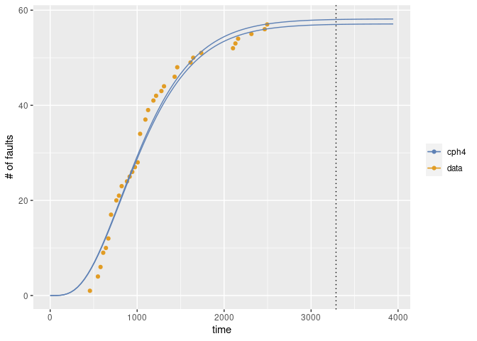

``` r

mvfplot(time=time, fault=fault, data=tomcat5.tester,
        srms=list(results.tomcat5$tester, result$srm$srms$tester))
```

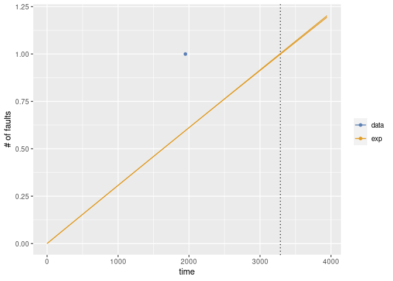

``` r

mvfplot(time=time, fault=fault, data=tomcat5.webapps,
        srms=list(results.tomcat5$webapps, result$srm$srms$webapps))
```

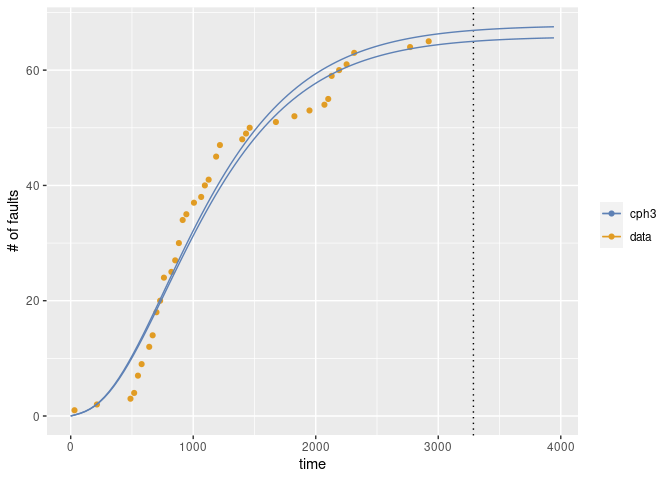
