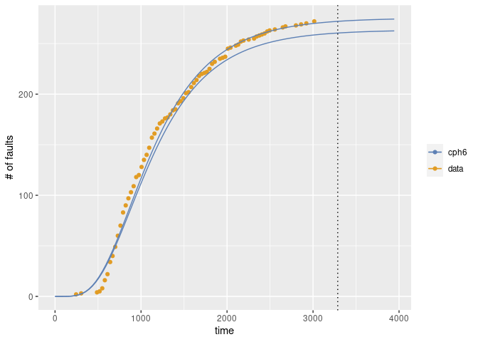

<!-- README.md is generated from README.Rmd. Please edit that file -->

# msrat

msrat provides the package to evalute the software reliability from the
fault data collected in the testing phase. The data used in msrat are
the fault data with d-metrics and s-metrics.

The examples of d-metrics are the number of test cases, coverages, etc.
for each time period such as a day and a week. They are the metrics to
represent the software testing environment for the testing period, and
dynamically change with the progress of software testing.

S-metrics are the number of codes, complexity, etc. and are the metrics
for the software products. They are assumed to be stable through whole
the software testing.

## Installation

You can install msrat from GitHub with:

``` r
install.packages("devtools")
devtools::install_github("SwReliab/msrat")
```

Alternatively, you can install msrat with remotes:

``` r
install.packages("remotes")
remotes::install_github("SwReliab/msrat")
```

## Example

This is an example for reliability evaluation with d-metrics.

``` r
### load library
library(msrat)
#> Loading required package: Rsrat
#> Warning: replacing previous import 'lifecycle::last_warnings' by
#> 'rlang::last_warnings' when loading 'tibble'
#> Warning: replacing previous import 'lifecycle::last_warnings' by
#> 'rlang::last_warnings' when loading 'pillar'

### load example data for d-metrics
data(dmet)

### dmet.ds1 consists of the number of days (day), the number of faults (fault), the number of testcases (tc), the cumulative number of testcases (ctc), the insrease of C0 coverage (cov) and C0 coverage (ccov).
dmet.ds1
#>    day fault  tc ctc   cov  ccov
#> 1    1     3   5   5 0.018 0.018
#> 2    2    16 175 180 0.409 0.427
#> 3    3     9 186 366 0.066 0.493
#> 4    4     3  67 433 0.132 0.625
#> 5    5     2  14 447 0.013 0.638
#> 6    6     0  54 501 0.055 0.693
#> 7    7     2  28 529 0.021 0.714
#> 8    8     1  15 544 0.018 0.732
#> 9    9     1  23 567 0.024 0.756
#> 10  10     2  17 584 0.026 0.782
#> 11  11     9  74 658 0.051 0.833
#> 12  12     3  43 701 0.011 0.844
#> 13  13     2  20 721 0.002 0.846
#> 14  14     1  12 733 0.013 0.859
#> 15  15     2  18 751 0.018 0.877
#> 16  16     7  19 770 0.018 0.895
#> 17  17     3   9 779 0.000 0.895
#> 18  18     0   9 788 0.003 0.898
#> 19  19     0  32 820 0.014 0.912
#> 20  20     0   8 828 0.000 0.912

### Esimate the model for d-metrics
(result <- fit.srm.logit(formula=fault~., data=dmet.ds1))
#>    fault X.Intercept. day  tc ctc   cov  ccov
#> 1      3            1   1   5   5 0.018 0.018
#> 2     16            1   2 175 180 0.409 0.427
#> 3      9            1   3 186 366 0.066 0.493
#> 4      3            1   4  67 433 0.132 0.625
#> 5      2            1   5  14 447 0.013 0.638
#> 6      0            1   6  54 501 0.055 0.693
#> 7      2            1   7  28 529 0.021 0.714
#> 8      1            1   8  15 544 0.018 0.732
#> 9      1            1   9  23 567 0.024 0.756
#> 10     2            1  10  17 584 0.026 0.782
#> 11     9            1  11  74 658 0.051 0.833
#> 12     3            1  12  43 701 0.011 0.844
#> 13     2            1  13  20 721 0.002 0.846
#> 14     1            1  14  12 733 0.013 0.859
#> 15     2            1  15  18 751 0.018 0.877
#> 16     7            1  16  19 770 0.018 0.895
#> 17     3            1  17   9 779 0.000 0.895
#> 18     0            1  18   9 788 0.003 0.898
#> 19     0            1  19  32 820 0.014 0.912
#> 20     0            1  20   8 828 0.000 0.912
#> 
#> Link function: logit
#> 
#>       omega  (Intercept)          day           tc          ctc          cov  
#>   66.033168    -3.671040     0.522465     0.017718    -0.006349    -0.457267  
#>        ccov  
#>   -0.423316  
#> Maximum LLF: -34.44726 
#> AIC: 82.89452 
#> Convergence: TRUE

### Select metrics in terms of AIC
(result.aic <- step(result))
#> Start:  AIC=82.89
#> fault ~ day + tc + ctc + cov + ccov
#> 
#>        Df    AIC
#> - ccov  1 80.897
#> - cov   1 80.902
#> - ctc   1 81.103
#> <none>    82.895
#> - day   1 86.312
#> - tc    1 91.551
#> 
#> Step:  AIC=80.9
#> fault ~ day + tc + ctc + cov
#> 
#>        Df    AIC
#> - cov   1 79.074
#> <none>    80.897
#> - ctc   1 85.223
#> - day   1 91.844
#> - tc    1 99.140
#> 
#> Step:  AIC=79.07
#> fault ~ day + tc + ctc
#> 
#>        Df     AIC
#> <none>     79.074
#> - ctc   1  86.021
#> - day   1  91.907
#> - tc    1 115.963
#>    fault X.Intercept. day  tc ctc
#> 1      3            1   1   5   5
#> 2     16            1   2 175 180
#> 3      9            1   3 186 366
#> 4      3            1   4  67 433
#> 5      2            1   5  14 447
#> 6      0            1   6  54 501
#> 7      2            1   7  28 529
#> 8      1            1   8  15 544
#> 9      1            1   9  23 567
#> 10     2            1  10  17 584
#> 11     9            1  11  74 658
#> 12     3            1  12  43 701
#> 13     2            1  13  20 721
#> 14     1            1  14  12 733
#> 15     2            1  15  18 751
#> 16     7            1  16  19 770
#> 17     3            1  17   9 779
#> 18     0            1  18   9 788
#> 19     0            1  19  32 820
#> 20     0            1  20   8 828
#> 
#> Link function: logit
#> 
#>       omega  (Intercept)          day           tc          ctc  
#>   66.041755    -3.789003     0.503204     0.016795    -0.006317  
#> Maximum LLF: -34.53719 
#> AIC: 79.07438 
#> Convergence: TRUE

### Draw the number of faults for each day and the number of faults estimated by the model (dmvplot is in Rsrat package)
dmvfplot(fault=dmet.ds1$fault, srms=result.aic)
```


This is an example for reliability evaluation with s-metrics.

``` r
### load example data for d-metrics
data(tomcat5)

### S-metrics for modules: catalina, connector, jasper, servlets, tester and webapps
#### LOC: Lines of code
#### St: The number of statements
#### Br: The number of branches
#### Co: Percentage of comments
#### Fn: The number of functions (methods)
#### Mc: Maximum complexity
#### Ac: Average complexity
tomcat5.smet
#>              LOC    St   Br   Co   Fn  Mc   Ac
#> catalina  125462 39386 19.2 34.4 4543  90 2.79
#> connector 168482 65829 19.2 26.9 5912 175 3.37
#> jasper     41861 15557 19.2 26.8 1691  90 2.88
#> servlets   15480  1944  8.0 66.5  400  26 1.45
#> tester     12677  4750 19.7 30.2  409  54 3.36
#> webapps    37782 12851  9.5 31.2 1035  39 2.32

### Each module has the fault data (grouped data)
tomcat5.catalina
#>     time fault
#> 1     31     0
#> 2     30     0
#> 3     31     0
#> 4     31     0
#> 5     30     0
#> 6     31     0
#> 7     30     0
#> 8     31     2
#> 9     31     0
#> 10    28     1
#> 11    31     0
#> 12    30     0
#> 13    31     0
#> 14    30     0
#> 15    31     0
#> 16    31     1
#> 17    30     1
#> 18    31     3
#> 19    30     8
#> 20    31     6
#> 21    31    12
#> 22    28     6
#> 23    31     9
#> 24    30    11
#> 25    31    10
#> 26    30    13
#> 27    31     7
#> 28    31     7
#> 29    30     6
#> 30    31     6
#> 31    30     9
#> 32    31     2
#> 33    31     8
#> 34    28     7
#> 35    31     5
#> 36    30     7
#> 37    31    10
#> 38    30     4
#> 39    31     5
#> 40    31     5
#> 41    30     2
#> 42    31     3
#> 43    30     1
#> 44    31     3
#> 45    31     4
#> 46    29     1
#> 47    31     6
#> 48    30     2
#> 49    31     3
#> 50    30     5
#> 51    31     1
#> 52    31     5
#> 53    30     4
#> 54    31     3
#> 55    30     4
#> 56    31     2
#> 57    31     1
#> 58    28     1
#> 59    31     3
#> 60    30     5
#> 61    31     2
#> 62    30     0
#> 63    31     3
#> 64    31     1
#> 65    30     1
#> 66    31     8
#> 67    30     1
#> 68    31     0
#> 69    31     2
#> 70    28     1
#> 71    31     3
#> 72    30     1
#> 73    31     0
#> 74    30     1
#> 75    31     0
#> 76    31     1
#> 77    30     2
#> 78    31     1
#> 79    30     1
#> 80    31     1
#> 81    31     2
#> 82    28     1
#> 83    31     0
#> 84    30     1
#> 85    31     0
#> 86    30     0
#> 87    31     2
#> 88    31     1
#> 89    30     0
#> 90    31     0
#> 91    30     0
#> 92    31     1
#> 93    31     0
#> 94    29     1
#> 95    31     0
#> 96    30     1
#> 97    31     0
#> 98    30     0
#> 99    31     2
#> 100   31     0
#> 101   30     0
#> 102   31     0
#> 103   30     0
#> 104   31     0
#> 105   31     0
#> 106   28     0
#> 107   31     0
#> 108   30     0

### List for fault data
data.tomcat5 <- list(catalina=tomcat5.catalina,
                     connector=tomcat5.connector,
                     jasper=tomcat5.jasper,
                     servlets=tomcat5.servlets,
                     tester=tomcat5.tester,
                     webapps=tomcat5.webapps)

### Estimate NHPP model (gamma model) parameters using Rsrt
# library(Rsrat)
(results.tomcat5 <- lapply(data.tomcat5,
                          function(d) fit.srm.nhpp(time=d$time,
                                                   fault=d$fault,
                                                   srm.names=c("gamma"))))
#> $catalina
#> Model name: gamma
#>     omega      shape       rate  
#> 2.729e+02  4.677e+00  3.861e-03  
#> Maximum LLF: -177.7182 
#> AIC: 361.4365 
#> Convergence: TRUE 
#> 
#> 
#> $connector
#> Model name: gamma
#>     omega      shape       rate  
#> 89.335012   4.865692   0.003888  
#> Maximum LLF: -110.3019 
#> AIC: 226.6037 
#> Convergence: TRUE 
#> 
#> 
#> $jasper
#> Model name: gamma
#>     omega      shape       rate  
#> 74.042904   4.778298   0.004604  
#> Maximum LLF: -92.44426 
#> AIC: 190.8885 
#> Convergence: TRUE 
#> 
#> 
#> $servlets
#> Model name: gamma
#>     omega      shape       rate  
#> 57.031424   5.282532   0.004888  
#> Maximum LLF: -83.21093 
#> AIC: 172.4219 
#> Convergence: TRUE 
#> 
#> 
#> $tester
#> Model name: gamma
#>    omega     shape      rate  
#>      1.0  163562.2      84.6  
#> Maximum LLF: -1.001187 
#> AIC: 8.002374 
#> Convergence: TRUE 
#> 
#> 
#> $webapps
#> Model name: gamma
#>     omega      shape       rate  
#> 65.826028   2.752425   0.002343  
#> Maximum LLF: -105.1848 
#> AIC: 216.3696 
#> Convergence: TRUE

### Estimate s-metrics (LOC and St) parameters
(result <- fit.srm.poireg(formula=~LOC+St, data=tomcat5.smet, srms=results.tomcat5))
#>           X.Intercept.    LOC    St
#> catalina             1 125462 39386
#> connector            1 168482 65829
#> jasper               1  41861 15557
#> servlets             1  15480  1944
#> tester               1  12677  4750
#> webapps              1  37782 12851
#> 
#> Link function: log
#>   (Intercept)           LOC            St 
#>  3.715768e+00  5.507954e-05 -1.279337e-04 
#> 
#> catalina
#> Model name: gamma
#> [1]  2.670e+02  4.680e+00  3.864e-03
#> 
#> connector
#> Model name: gamma
#> [1]  96.924516   4.853124   0.003875
#> 
#> jasper
#> Model name: gamma
#> [1]  56.327808   4.785058   0.004612
#> 
#> servlets
#> Model name: gamma
#> [1]  75.165793   5.272732   0.004877
#> 
#> tester
#> Model name: gamma
#> [1]  4.498e+01  2.211e+00  9.050e-05
#> 
#> webapps
#> Model name: gamma
#> [1]  63.605977   2.760161   0.002353
#> Maximum LLF: -579.6683 
#> AIC: 1189.337 
#> Convergence: TRUE

### Draw 
mvfplot(time=time, fault=fault, data=tomcat5.catalina,
        srms=list(results.tomcat5$catalina, result$srm$srms$catalina))
```


## Examples for penalized MLE

This is an example by applying the penalized MLE on regression
coefficients.

``` r
### load library
library(msrat)

### load example data for d-metrics
data(dmet)

### dmet.ds1 consists of the number of days (day), the number of faults (fault), the number of testcases (tc), the cumulative number of testcases (ctc), the insrease of C0 coverage (cov) and C0 coverage (ccov).
dmet.ds1
#>    day fault  tc ctc   cov  ccov
#> 1    1     3   5   5 0.018 0.018
#> 2    2    16 175 180 0.409 0.427
#> 3    3     9 186 366 0.066 0.493
#> 4    4     3  67 433 0.132 0.625
#> 5    5     2  14 447 0.013 0.638
#> 6    6     0  54 501 0.055 0.693
#> 7    7     2  28 529 0.021 0.714
#> 8    8     1  15 544 0.018 0.732
#> 9    9     1  23 567 0.024 0.756
#> 10  10     2  17 584 0.026 0.782
#> 11  11     9  74 658 0.051 0.833
#> 12  12     3  43 701 0.011 0.844
#> 13  13     2  20 721 0.002 0.846
#> 14  14     1  12 733 0.013 0.859
#> 15  15     2  18 751 0.018 0.877
#> 16  16     7  19 770 0.018 0.895
#> 17  17     3   9 779 0.000 0.895
#> 18  18     0   9 788 0.003 0.898
#> 19  19     0  32 820 0.014 0.912
#> 20  20     0   8 828 0.000 0.912

### Esimate the model for d-metrics
### lambda is the hyper parameter to determine the magniture of penalty.
### alpha is the parameter to determine the lorm; alpha=1 means L1 norm, alpha=0 indicates L2 norm
(result <- fit.srm.logit.penalized(formula=fault~., data=dmet.ds1, lambda=0.1, alpha=1))
#> Warning in Rsrat::emfit(model, ldata, initialize = TRUE, maxiter =
#> con$maxiter, : LLF decreses: dGLM.penalized.logit 8 -4.815128e-03
#> Warning in Rsrat::emfit(model, ldata, initialize = TRUE, maxiter =
#> con$maxiter, : LLF decreses: dGLM.penalized.logit 9 -8.356620e-03
#> Warning in Rsrat::emfit(model, ldata, initialize = TRUE, maxiter =
#> con$maxiter, : LLF decreses: dGLM.penalized.logit 10 -9.025693e-03
#> Warning in Rsrat::emfit(model, ldata, initialize = TRUE, maxiter =
#> con$maxiter, : LLF decreses: dGLM.penalized.logit 11 -8.494761e-03
#> Warning in Rsrat::emfit(model, ldata, initialize = TRUE, maxiter =
#> con$maxiter, : LLF decreses: dGLM.penalized.logit 12 -7.515602e-03
#> Warning in Rsrat::emfit(model, ldata, initialize = TRUE, maxiter =
#> con$maxiter, : LLF decreses: dGLM.penalized.logit 13 -6.431391e-03
#> Warning in Rsrat::emfit(model, ldata, initialize = TRUE, maxiter =
#> con$maxiter, : LLF decreses: dGLM.penalized.logit 14 -5.394990e-03
#> Warning in Rsrat::emfit(model, ldata, initialize = TRUE, maxiter =
#> con$maxiter, : LLF decreses: dGLM.penalized.logit 15 -4.468176e-03
#> Warning in Rsrat::emfit(model, ldata, initialize = TRUE, maxiter =
#> con$maxiter, : LLF decreses: dGLM.penalized.logit 16 -3.668910e-03
#> Warning in Rsrat::emfit(model, ldata, initialize = TRUE, maxiter =
#> con$maxiter, : LLF decreses: dGLM.penalized.logit 17 -2.994591e-03
#> Warning in Rsrat::emfit(model, ldata, initialize = TRUE, maxiter =
#> con$maxiter, : LLF decreses: dGLM.penalized.logit 18 -2.433695e-03
#> Warning in Rsrat::emfit(model, ldata, initialize = TRUE, maxiter =
#> con$maxiter, : LLF decreses: dGLM.penalized.logit 19 -1.971607e-03
#> Warning in Rsrat::emfit(model, ldata, initialize = TRUE, maxiter =
#> con$maxiter, : LLF decreses: dGLM.penalized.logit 20 -1.593485e-03
#> Warning in Rsrat::emfit(model, ldata, initialize = TRUE, maxiter =
#> con$maxiter, : LLF decreses: dGLM.penalized.logit 21 -1.285575e-03
#> Warning in Rsrat::emfit(model, ldata, initialize = TRUE, maxiter =
#> con$maxiter, : LLF decreses: dGLM.penalized.logit 22 -1.035740e-03
#> Warning in Rsrat::emfit(model, ldata, initialize = TRUE, maxiter =
#> con$maxiter, : LLF decreses: dGLM.penalized.logit 23 -8.335721e-04
#> Warning in Rsrat::emfit(model, ldata, initialize = TRUE, maxiter =
#> con$maxiter, : LLF decreses: dGLM.penalized.logit 24 -6.703120e-04
#> Warning in Rsrat::emfit(model, ldata, initialize = TRUE, maxiter =
#> con$maxiter, : LLF decreses: dGLM.penalized.logit 25 -5.386789e-04
#> Warning in Rsrat::emfit(model, ldata, initialize = TRUE, maxiter =
#> con$maxiter, : LLF decreses: dGLM.penalized.logit 26 -4.326751e-04
#> Warning in Rsrat::emfit(model, ldata, initialize = TRUE, maxiter =
#> con$maxiter, : LLF decreses: dGLM.penalized.logit 27 -3.473916e-04
#> Warning in Rsrat::emfit(model, ldata, initialize = TRUE, maxiter =
#> con$maxiter, : LLF decreses: dGLM.penalized.logit 28 -2.788294e-04
#> Warning in Rsrat::emfit(model, ldata, initialize = TRUE, maxiter =
#> con$maxiter, : LLF decreses: dGLM.penalized.logit 29 -2.237423e-04
#> Warning in Rsrat::emfit(model, ldata, initialize = TRUE, maxiter =
#> con$maxiter, : LLF decreses: dGLM.penalized.logit 30 -1.795024e-04
#> Warning in Rsrat::emfit(model, ldata, initialize = TRUE, maxiter =
#> con$maxiter, : LLF decreses: dGLM.penalized.logit 31 -1.439869e-04
#> Warning in Rsrat::emfit(model, ldata, initialize = TRUE, maxiter =
#> con$maxiter, : LLF decreses: dGLM.penalized.logit 32 -1.154836e-04
#> Warning in Rsrat::emfit(model, ldata, initialize = TRUE, maxiter =
#> con$maxiter, : LLF decreses: dGLM.penalized.logit 33 -9.261331e-05
#> Warning in Rsrat::emfit(model, ldata, initialize = TRUE, maxiter =
#> con$maxiter, : LLF decreses: dGLM.penalized.logit 34 -7.426617e-05
#> Warning in Rsrat::emfit(model, ldata, initialize = TRUE, maxiter =
#> con$maxiter, : LLF decreses: dGLM.penalized.logit 35 -5.954981e-05
#> Warning in Rsrat::emfit(model, ldata, initialize = TRUE, maxiter =
#> con$maxiter, : LLF decreses: dGLM.penalized.logit 36 -4.774711e-05
#> Warning in Rsrat::emfit(model, ldata, initialize = TRUE, maxiter =
#> con$maxiter, : LLF decreses: dGLM.penalized.logit 37 -3.828210e-05
#> Warning in Rsrat::emfit(model, ldata, initialize = TRUE, maxiter =
#> con$maxiter, : LLF decreses: dGLM.penalized.logit 38 -3.069233e-05
#> Warning in Rsrat::emfit(model, ldata, initialize = TRUE, maxiter =
#> con$maxiter, : LLF decreses: dGLM.penalized.logit 39 -2.460664e-05
#> Warning in Rsrat::emfit(model, ldata, initialize = TRUE, maxiter =
#> con$maxiter, : LLF decreses: dGLM.penalized.logit 40 -1.972720e-05
#> Warning in Rsrat::emfit(model, ldata, initialize = TRUE, maxiter =
#> con$maxiter, : LLF decreses: dGLM.penalized.logit 41 -1.581508e-05
#> Warning in Rsrat::emfit(model, ldata, initialize = TRUE, maxiter =
#> con$maxiter, : LLF decreses: dGLM.penalized.logit 42 -1.267859e-05
#> Warning in Rsrat::emfit(model, ldata, initialize = TRUE, maxiter =
#> con$maxiter, : LLF decreses: dGLM.penalized.logit 43 -1.016403e-05
#> Warning in Rsrat::emfit(model, ldata, initialize = TRUE, maxiter =
#> con$maxiter, : LLF decreses: dGLM.penalized.logit 44 -8.148117e-06
#> Warning in Rsrat::emfit(model, ldata, initialize = TRUE, maxiter =
#> con$maxiter, : LLF decreses: dGLM.penalized.logit 45 -6.531988e-06
#> Warning in Rsrat::emfit(model, ldata, initialize = TRUE, maxiter =
#> con$maxiter, : LLF decreses: dGLM.penalized.logit 46 -5.236378e-06
#> Warning in Rsrat::emfit(model, ldata, initialize = TRUE, maxiter =
#> con$maxiter, : LLF decreses: dGLM.penalized.logit 47 -4.197732e-06
#> Warning in Rsrat::emfit(model, ldata, initialize = TRUE, maxiter =
#> con$maxiter, : LLF decreses: dGLM.penalized.logit 48 -3.365090e-06
#> Warning in Rsrat::emfit(model, ldata, initialize = TRUE, maxiter =
#> con$maxiter, : LLF decreses: dGLM.penalized.logit 49 -2.697600e-06
#> Warning in Rsrat::emfit(model, ldata, initialize = TRUE, maxiter =
#> con$maxiter, : LLF decreses: dGLM.penalized.logit 50 -2.162506e-06
#> Warning in Rsrat::emfit(model, ldata, initialize = TRUE, maxiter =
#> con$maxiter, : LLF decreses: dGLM.penalized.logit 51 -1.733550e-06
#> Warning in Rsrat::emfit(model, ldata, initialize = TRUE, maxiter =
#> con$maxiter, : LLF decreses: dGLM.penalized.logit 52 -1.389680e-06
#> Warning in Rsrat::emfit(model, ldata, initialize = TRUE, maxiter =
#> con$maxiter, : LLF decreses: dGLM.penalized.logit 53 -1.114019e-06
#> Warning in Rsrat::emfit(model, ldata, initialize = TRUE, maxiter =
#> con$maxiter, : LLF decreses: dGLM.penalized.logit 54 -8.930379e-07
#> Warning in Rsrat::emfit(model, ldata, initialize = TRUE, maxiter =
#> con$maxiter, : LLF decreses: dGLM.penalized.logit 55 -7.158911e-07
#>    fault X.Intercept. day  tc ctc   cov  ccov
#> 1      3            1   1   5   5 0.018 0.018
#> 2     16            1   2 175 180 0.409 0.427
#> 3      9            1   3 186 366 0.066 0.493
#> 4      3            1   4  67 433 0.132 0.625
#> 5      2            1   5  14 447 0.013 0.638
#> 6      0            1   6  54 501 0.055 0.693
#> 7      2            1   7  28 529 0.021 0.714
#> 8      1            1   8  15 544 0.018 0.732
#> 9      1            1   9  23 567 0.024 0.756
#> 10     2            1  10  17 584 0.026 0.782
#> 11     9            1  11  74 658 0.051 0.833
#> 12     3            1  12  43 701 0.011 0.844
#> 13     2            1  13  20 721 0.002 0.846
#> 14     1            1  14  12 733 0.013 0.859
#> 15     2            1  15  18 751 0.018 0.877
#> 16     7            1  16  19 770 0.018 0.895
#> 17     3            1  17   9 779 0.000 0.895
#> 18     0            1  18   9 788 0.003 0.898
#> 19     0            1  19  32 820 0.014 0.912
#> 20     0            1  20   8 828 0.000 0.912
#> 
#> Link function: logit
#> 
#>       omega  (Intercept)          day           tc          ctc          cov  
#>      78.673       -2.348        0.000        0.000        0.000        0.000  
#>        ccov  
#>       0.000  
#> Maximum LLF: -58.88721 
#> AIC: 131.7744 
#> Convergence: TRUE

### Draw the number of faults for each day and the number of faults estimated by the model (dmvplot is in Rsrat package)
dmvfplot(fault=dmet.ds1$fault, srms=list(result$srm))
```


``` r
### load example data for d-metrics
data(tomcat5)

### S-metrics for modules: catalina, connector, jasper, servlets, tester and webapps
#### LOC: Lines of code
#### St: The number of statements
#### Br: The number of branches
#### Co: Percentage of comments
#### Fn: The number of functions (methods)
#### Mc: Maximum complexity
#### Ac: Average complexity
tomcat5.smet
#>              LOC    St   Br   Co   Fn  Mc   Ac
#> catalina  125462 39386 19.2 34.4 4543  90 2.79
#> connector 168482 65829 19.2 26.9 5912 175 3.37
#> jasper     41861 15557 19.2 26.8 1691  90 2.88
#> servlets   15480  1944  8.0 66.5  400  26 1.45
#> tester     12677  4750 19.7 30.2  409  54 3.36
#> webapps    37782 12851  9.5 31.2 1035  39 2.32

### Each module has the fault data (grouped data)
tomcat5.catalina
#>     time fault
#> 1     31     0
#> 2     30     0
#> 3     31     0
#> 4     31     0
#> 5     30     0
#> 6     31     0
#> 7     30     0
#> 8     31     2
#> 9     31     0
#> 10    28     1
#> 11    31     0
#> 12    30     0
#> 13    31     0
#> 14    30     0
#> 15    31     0
#> 16    31     1
#> 17    30     1
#> 18    31     3
#> 19    30     8
#> 20    31     6
#> 21    31    12
#> 22    28     6
#> 23    31     9
#> 24    30    11
#> 25    31    10
#> 26    30    13
#> 27    31     7
#> 28    31     7
#> 29    30     6
#> 30    31     6
#> 31    30     9
#> 32    31     2
#> 33    31     8
#> 34    28     7
#> 35    31     5
#> 36    30     7
#> 37    31    10
#> 38    30     4
#> 39    31     5
#> 40    31     5
#> 41    30     2
#> 42    31     3
#> 43    30     1
#> 44    31     3
#> 45    31     4
#> 46    29     1
#> 47    31     6
#> 48    30     2
#> 49    31     3
#> 50    30     5
#> 51    31     1
#> 52    31     5
#> 53    30     4
#> 54    31     3
#> 55    30     4
#> 56    31     2
#> 57    31     1
#> 58    28     1
#> 59    31     3
#> 60    30     5
#> 61    31     2
#> 62    30     0
#> 63    31     3
#> 64    31     1
#> 65    30     1
#> 66    31     8
#> 67    30     1
#> 68    31     0
#> 69    31     2
#> 70    28     1
#> 71    31     3
#> 72    30     1
#> 73    31     0
#> 74    30     1
#> 75    31     0
#> 76    31     1
#> 77    30     2
#> 78    31     1
#> 79    30     1
#> 80    31     1
#> 81    31     2
#> 82    28     1
#> 83    31     0
#> 84    30     1
#> 85    31     0
#> 86    30     0
#> 87    31     2
#> 88    31     1
#> 89    30     0
#> 90    31     0
#> 91    30     0
#> 92    31     1
#> 93    31     0
#> 94    29     1
#> 95    31     0
#> 96    30     1
#> 97    31     0
#> 98    30     0
#> 99    31     2
#> 100   31     0
#> 101   30     0
#> 102   31     0
#> 103   30     0
#> 104   31     0
#> 105   31     0
#> 106   28     0
#> 107   31     0
#> 108   30     0

### List for fault data
data.tomcat5 <- list(catalina=tomcat5.catalina,
                     connector=tomcat5.connector,
                     jasper=tomcat5.jasper,
                     servlets=tomcat5.servlets,
                     tester=tomcat5.tester,
                     webapps=tomcat5.webapps)

### Estimate NHPP model (gamma model) parameters using Rsrt
# library(Rsrat)
(results.tomcat5 <- lapply(data.tomcat5,
                          function(d) fit.srm.nhpp(time=d$time,
                                                   fault=d$fault,
                                                   srm.names=c("gamma"))))
#> $catalina
#> Model name: gamma
#>     omega      shape       rate  
#> 2.729e+02  4.677e+00  3.861e-03  
#> Maximum LLF: -177.7182 
#> AIC: 361.4365 
#> Convergence: TRUE 
#> 
#> 
#> $connector
#> Model name: gamma
#>     omega      shape       rate  
#> 89.335012   4.865692   0.003888  
#> Maximum LLF: -110.3019 
#> AIC: 226.6037 
#> Convergence: TRUE 
#> 
#> 
#> $jasper
#> Model name: gamma
#>     omega      shape       rate  
#> 74.042904   4.778298   0.004604  
#> Maximum LLF: -92.44426 
#> AIC: 190.8885 
#> Convergence: TRUE 
#> 
#> 
#> $servlets
#> Model name: gamma
#>     omega      shape       rate  
#> 57.031424   5.282532   0.004888  
#> Maximum LLF: -83.21093 
#> AIC: 172.4219 
#> Convergence: TRUE 
#> 
#> 
#> $tester
#> Model name: gamma
#>    omega     shape      rate  
#>      1.0  163562.2      84.6  
#> Maximum LLF: -1.001187 
#> AIC: 8.002374 
#> Convergence: TRUE 
#> 
#> 
#> $webapps
#> Model name: gamma
#>     omega      shape       rate  
#> 65.826028   2.752425   0.002343  
#> Maximum LLF: -105.1848 
#> AIC: 216.3696 
#> Convergence: TRUE

### Estimate s-metrics parameters with penalty
(result <- fit.srm.poireg.penalized(formula=~., data=tomcat5.smet, srms=results.tomcat5, lambda=1))
#>           X.Intercept.    LOC    St   Br   Co   Fn  Mc   Ac
#> catalina             1 125462 39386 19.2 34.4 4543  90 2.79
#> connector            1 168482 65829 19.2 26.9 5912 175 3.37
#> jasper               1  41861 15557 19.2 26.8 1691  90 2.88
#> servlets             1  15480  1944  8.0 66.5  400  26 1.45
#> tester               1  12677  4750 19.7 30.2  409  54 3.36
#> webapps              1  37782 12851  9.5 31.2 1035  39 2.32
#> 
#> Link function: log
#>   (Intercept)           LOC            St            Br            Co 
#>  3.7120308051  0.0000000000  0.0000000000  0.0836159762  0.0000000000 
#>            Fn            Mc            Ac 
#>  0.0004273504 -0.0188145514  0.0000000000 
#> 
#> catalina
#> Model name: gamma
#> [1]  2.613e+02  4.682e+00  3.867e-03
#> 
#> connector
#> Model name: gamma
#> [1]  94.765592   4.856737   0.003879
#> 
#> jasper
#> Model name: gamma
#> [1]  77.230726   4.777068   0.004602
#> 
#> servlets
#> Model name: gamma
#> [1]  58.132240   5.281945   0.004888
#> 
#> tester
#> Model name: gamma
#> [1]  9.166e+01  2.200e+00  6.298e-05
#> 
#> webapps
#> Model name: gamma
#> [1]  67.688933   2.745854   0.002334
#> Maximum LLF: -597.7553 
#> AIC: 1235.511 
#> Convergence: TRUE

### Draw 
mvfplot(time=time, fault=fault, data=tomcat5.catalina,
        srms=list(results.tomcat5$catalina, result$srm$srms$catalina))
```


